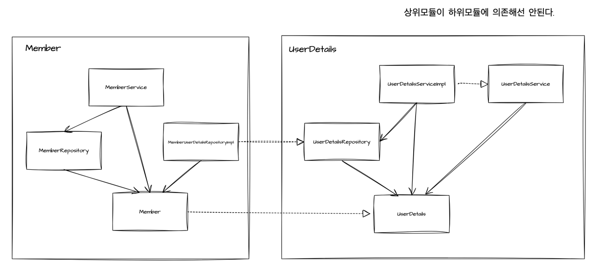

# Closest 프로젝트
- rss를 사용하여 관심 블로그를 커스텀하게 관리할 수 있는 어플리케이션입니다. 

## 구조 설명
### 컨트롤러(Controller)
- HTTP 요청을 처리하고 적절한 서비스로 라우팅합니다.
### 애플리케이션 서비스(Application Service)
- 어플리케이션에 밀접한 비즈니스 로직을 구현하고 도메인 서비스를 호출하여 요청을 처리합니다. 
### 도메인 서비스(Domain Service)
- 핵심 비즈니스 로직을 포함하며 애플리케이션 서비스 및 리포지토리와 엔티티로 통신하여 데이터를 처리합니다.
### 리포지토리(Repository)
- 데이터베이스와 통신하여 데이터를 읽거나 쓰는 역할을 담당합니다.

## 토큰 처리 방식
### 토큰 생성
- 로그인 또는 인증이 성공하면, 서버는 엑세스 토큰과 리프레시 토큰을 생성하고 이를 쿠키에 담아 응답합니다.
### 토큰 인증
- 사용자가 보호된 엔드포인트에 접근하려면, 엑세스 토큰을 헤더에 담아 요청해야 합니다.
### 토큰 갱신
- 엑세스 토큰의 유효 기간이 만료되면, 클라이언트는 쿠키에 저장된 리프레시 토큰을 사용하여 다시 서버에 인증을 요청합니다. 서버는 새로운 엑세스 토큰을 생성하고 이를 쿠키에 담아 응답합니다.

# Feed, FeedItem
- rss에서 전달받은 SyndEntry와 SyndFeed의 기능을 외부 노출 하지 않기 위해 private 필드로 받고 
- Feed, FeedItem 인터페이스로 사용할 기능만 외부 노출시킴
- 상속을 하지 않아 불필요하게 SyndEntry나 SyndFeed의 타입으로 받게 될 경우를 차단

# UserDetails

